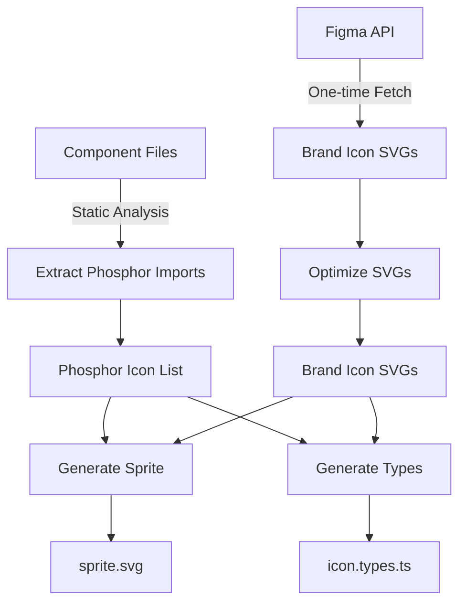

# Icon Component Specification for Kumo

## Executive Summary

This specification defines the implementation of a sprite-based Icon component for the Kumo design system. The component consolidates Phosphor icons (currently used in Kumo components) and Cloudflare brand icons into a unified, performant, and type-safe system with seamless Figma plugin integration.

### Key Design Decisions

- **Sprite-based delivery**: Single SVG sprite with `<use>` references for optimal performance
- **Hybrid build approach**: Pre-built sprite shipped with Kumo + optional build plugin for tree-shaking
- **Naming convention**:
  - Phosphor icons: `ph-*` prefix (e.g., `ph-check`, `ph-arrow-right`)
  - Brand icons: `cf-*` prefix (e.g., `cf-workers`, `cf-pages`)
- **Type safety**: TypeScript template literal types for autocomplete and validation
- **Component style**: Object-based variants matching Kumo patterns (NO CVA)
- **Migration strategy**: Hard cutover via codemod (no deprecated aliases)
- **Figma integration**: Full Icon Library page with all icons for instance swapping

---

## Background Context

### Problem Statement

From the team discussion (see conversation history in this file below):

1. **Package dependency**: Installing Kumo currently requires installing both `@cloudflare/kumo` and `@phosphor-icons/react`
2. **Performance**: Inline SVGs result in DOM bloat (100 instances = 100× markup)
3. **Discoverability**: No TypeScript autocomplete for available icons
4. **Brand icons**: No home for Cloudflare-specific icons (Workers, Pages, etc.)
5. **Migration complexity**: CL1 icon codemods need unified interface
6. **Figma sync**: Need seamless workflow between design and code

### Guiding Principles

> "I am very sensitive to the abstractions argument... they're evil." - Jonnie

The Icon component is NOT abstraction for abstraction's sake. It solves:
- **Delivery optimization**: Sprite vs inline (real performance wins)
- **Content consolidation**: Phosphor + brand icons in one place
- **Migration path**: CL1 → unified system

The `glyph` names ARE the Phosphor names - no weird mappings, no hiding dependencies.

---

## Technical Architecture

### 1. File Structure

```
packages/kumo/
├── src/
│   ├── components/
│   │   └── icon/
│   │       ├── icon.tsx              # Icon component
│   │       ├── icon.types.ts         # Generated types
│   │       └── index.ts               # Public exports
│   ├── assets/
│   │   └── icons/
│   │       ├── brand/                 # cf-* icons (from Figma, one-time fetch)
│   │       │   ├── cf-workers.svg
│   │       │   ├── cf-pages.svg
│   │       │   └── ...
│   │       └── sprite.svg             # Generated sprite (git-ignored or committed)
└── scripts/
    ├── icon/
    │   ├── build-sprite.ts            # Main build orchestrator
    │   ├── extract-phosphor-icons.ts  # Static analysis of component imports
    │   ├── fetch-brand-icons.ts       # One-time Figma API fetch
    │   ├── generate-sprite.ts         # Combines icons into sprite.svg
    │   ├── generate-types.ts          # Generates TypeScript union types
    │   └── optimize-svg.ts            # SVGO for brand icons only
    └── legacy-context/                # Reference implementation (archived)
```

### 2. Icon Naming Convention

#### Phosphor Icons: `ph-*`

Examples:
- `ph-check` (from `CheckIcon`)
- `ph-arrow-right` (from `ArrowRightIcon`)
- `ph-caret-down` (from `CaretDownIcon`)

Conversion: PascalCase → kebab-case, strip "Icon" suffix

#### Brand Icons: `cf-*`

Examples:
- `cf-workers`
- `cf-pages`
- `cf-r2`

Source: Fetched once from Figma file
https://www.figma.com/design/f15DmkwRAbKFbZLSQErUos/Icon-Library?node-id=45-2511

---

## Component API

### Component Interface

```typescript
import type { ComponentProps } from 'react';

// Generated type from build process
export type PhosphorIcon = `ph-${string}`;
export type BrandIcon = `cf-${string}`;
export type IconGlyph = PhosphorIcon | BrandIcon;

export const KUMO_ICON_VARIANTS = {
  size: {
    xs: {
      classes: "size-3",
      description: "12px - small UI elements",
    },
    sm: {
      classes: "size-4",
      description: "16px - standard inline icons",
    },
    base: {
      classes: "size-5",
      description: "20px - default size",
    },
    lg: {
      classes: "size-6",
      description: "24px - prominent icons",
    },
    xl: {
      classes: "size-8",
      description: "32px - hero sections",
    },
  },
  look: {
    default: {
      classes: "text-surface",
      description: "Default text color",
    },
    muted: {
      classes: "text-muted",
      description: "Subtle, secondary icons",
    },
    primary: {
      classes: "text-primary",
      description: "Brand color emphasis",
    },
    info: {
      classes: "text-info",
      description: "Informational state",
    },
    success: {
      classes: "text-success",
      description: "Success state",
    },
    warning: {
      classes: "text-warning",
      description: "Warning state",
    },
    error: {
      classes: "text-error",
      description: "Error/destructive state",
    },
    currentColor: {
      classes: "text-current",
      description: "Inherit from parent",
    },
  },
} as const;

export const KUMO_ICON_DEFAULT_VARIANTS = {
  size: "base",
  look: "currentColor",
} as const;

export type KumoIconSize = keyof typeof KUMO_ICON_VARIANTS.size;
export type KumoIconLook = keyof typeof KUMO_ICON_VARIANTS.look;

export interface KumoIconVariantsProps {
  size?: KumoIconSize;
  look?: KumoIconLook;
}

export type IconProps = ComponentProps<'svg'> &
  KumoIconVariantsProps & {
    glyph: IconGlyph;
    title?: string;
  };
```

### Component Implementation Pattern

```typescript
import { useId } from 'react';
import { cn } from '../../utils/cn';
import spriteUrl from '../../assets/icons/sprite.svg';

export function iconVariants({
  size = KUMO_ICON_DEFAULT_VARIANTS.size,
  look = KUMO_ICON_DEFAULT_VARIANTS.look,
}: KumoIconVariantsProps = {}) {
  return cn(
    // Base styles
    "inline-block shrink-0",
    // Apply variant styles
    KUMO_ICON_VARIANTS.size[size].classes,
    KUMO_ICON_VARIANTS.look[look].classes,
  );
}

export function Icon({
  glyph,
  size = KUMO_ICON_DEFAULT_VARIANTS.size,
  look = KUMO_ICON_DEFAULT_VARIANTS.look,
  title,
  className,
  ...props
}: IconProps) {
  const id = useId();
  const ariaHidden = !title;

  // Development mode: warn on missing glyph
  if (process.env.NODE_ENV !== 'production') {
    // Runtime check can validate against known glyphs
    // Render placeholder: <text>?</text> or icon name
  }

  return (
    <svg
      aria-hidden={ariaHidden}
      role={ariaHidden ? undefined : 'img'}
      aria-labelledby={ariaHidden ? undefined : id}
      className={cn(iconVariants({ size, look }), className)}
      {...props}
    >
      {title && <title id={id}>{title}</title>}
      <use href={`${spriteUrl}#${glyph}`} />
    </svg>
  );
}
```

### Usage Examples

```tsx
import { Icon } from '@cloudflare/kumo';

// Basic usage - defaults to currentColor
<Icon glyph="ph-check" />

// With semantic color and size
<Icon glyph="ph-arrow-right" look="primary" size="lg" />

// Brand icon
<Icon glyph="cf-workers" size="xl" />

// Accessible icon with title
<Icon glyph="ph-info" title="Information" />

// Custom className for positioning/margin
<Icon glyph="ph-plus" className="mr-2" />

// In Button component
<Button icon={<Icon glyph="ph-plus" />}>
  Add Item
</Button>
```

---

## Build Process

### Build Script Architecture

#### 1. Extract Phosphor Icons (`extract-phosphor-icons.ts`)

**Purpose**: Static analysis of `packages/kumo/src/components/**/*` to find Phosphor imports

**Algorithm**:
```typescript
// Scan all component files
const componentFiles = glob('packages/kumo/src/components/**/*.{ts,tsx}');

// Extract imports using AST parser or regex
const imports = files.map(file => {
  const content = readFile(file);
  const matches = content.matchAll(/import\s+{([^}]+)}\s+from\s+["']@phosphor-icons\/react["']/g);
  return parseImportNames(matches);
});

// Convert to kebab-case with ph- prefix
const iconNames = imports
  .flat()
  .filter(name => name !== 'Icon' && name !== 'IconContext')
  .map(name => pascalToKebab(name.replace(/Icon$/, '')))
  .map(name => `ph-${name}`);

return Array.from(new Set(iconNames));
```

**Current icons to extract** (based on codebase analysis):
- ArrowRightIcon → `ph-arrow-right`
- ArrowsClockwise → `ph-arrows-clockwise`
- CaretDownIcon → `ph-caret-down`
- CaretUpDownIcon → `ph-caret-up-down`
- CheckIcon → `ph-check`
- ClipboardIcon → `ph-clipboard`
- Eye → `ph-eye`
- EyeSlash → `ph-eye-slash`
- InfoIcon → `ph-info`
- MinusIcon → `ph-minus`
- PlusIcon → `ph-plus`
- XIcon → `ph-x`

#### 2. Fetch Brand Icons (`fetch-brand-icons.ts`)

**Purpose**: One-time fetch from Figma, store as individual SVG files

**Figma API Details**:
- File ID: `f15DmkwRAbKFbZLSQErUos`
- Node ID: `45-2511` (Icon Library page)
- Auth: `FIGMA_TOKEN` environment variable

**Implementation** (based on legacy context):
```typescript
import { fetchComponents, fetchSvg } from '../legacy-context/build-icons/fetchers';
import { downloadAndWriteSVGs } from '../legacy-context/build-icons/file-operations';

async function fetchBrandIcons() {
  const fileId = 'f15DmkwRAbKFbZLSQErUos';
  const components = await fetchComponents(fileId);

  // Filter to Icon Library page
  const iconComponents = components.meta.components.filter(
    c => c.containing_frame.pageName === 'Icon Library'
  );

  const nodeIds = iconComponents.map(c => c.node_id).join(',');
  const svgs = await fetchSvg(fileId, nodeIds);

  // Convert names to cf-* format
  const icons = iconComponents.map(c => ({
    name: `cf-${toDashCase(c.name)}`,
    nodeId: c.node_id,
  }));

  await downloadAndWriteSVGs(
    icons,
    svgs.images,
    'packages/kumo/src/assets/icons/brand'
  );
}
```

**Output**: `packages/kumo/src/assets/icons/brand/cf-*.svg`

**Note**: This script is run ONCE manually, not in CI. Brand icons are committed to the repo.

#### 3. Optimize SVGs (`optimize-svg.ts`)

**Purpose**: Run SVGO on brand icons only (trust Phosphor optimization)

**Configuration** (from legacy context):
```javascript
// svgo.config.cjs
module.exports = {
  plugins: [
    'removeDoctype',
    'removeXMLProcInst',
    'removeComments',
    'removeMetadata',
    'removeEditorsNSData',
    'cleanupAttrs',
    'mergeStyles',
    'inlineStyles',
    'minifyStyles',
    'cleanupIds',
    'removeUselessDefs',
    'cleanupNumericValues',
    'convertColors',
    'removeUnknownsAndDefaults',
    'removeNonInheritableGroupAttrs',
    'removeUselessStrokeAndFill',
    'removeViewBox',
    'cleanupEnableBackground',
    'removeHiddenElems',
    'removeEmptyText',
    'convertShapeToPath',
    'convertEllipseToCircle',
    'moveElemsAttrsToGroup',
    'moveGroupAttrsToElems',
    'collapseGroups',
    'convertPathData',
    'convertTransform',
    'removeEmptyAttrs',
    'removeEmptyContainers',
    'mergePaths',
    'removeUnusedNS',
    'sortDefsChildren',
    'removeTitle',
    'removeDesc',
  ],
};
```

**Implementation**:
```typescript
import { optimize } from 'svgo';
import svgoConfig from './svgo.config.cjs';

async function optimizeBrandIcons() {
  const brandIconFiles = glob('packages/kumo/src/assets/icons/brand/*.svg');

  for (const file of brandIconFiles) {
    const svg = await readFile(file, 'utf-8');
    const result = optimize(svg, svgoConfig);
    await writeFile(file, result.data);
  }
}
```

#### 4. Generate Sprite (`generate-sprite.ts`)

**Purpose**: Combine Phosphor + brand icons into single `sprite.svg`

**Algorithm**:
```typescript
async function generateSprite() {
  // 1. Get Phosphor SVG content
  const phosphorIcons = await extractPhosphorIcons();
  const phosphorSvgs = await Promise.all(
    phosphorIcons.map(async (name) => {
      // Extract from @phosphor-icons/react/dist/
      const iconName = name.replace('ph-', '');
      const svgPath = require.resolve(
        `@phosphor-icons/react/dist/icons/${kebabToPascal(iconName)}.svg`
      );
      return {
        name,
        svg: await readFile(svgPath, 'utf-8'),
      };
    })
  );

  // 2. Get brand SVG content
  const brandSvgs = await Promise.all(
    glob('packages/kumo/src/assets/icons/brand/*.svg').map(async (path) => ({
      name: basename(path, '.svg'),
      svg: await readFile(path, 'utf-8'),
    }))
  );

  // 3. Combine into sprite
  const symbols = [...phosphorSvgs, ...brandSvgs].map(({ name, svg }) => {
    // Extract viewBox and paths from SVG
    const viewBox = svg.match(/viewBox="([^"]+)"/)?.[1] || '0 0 24 24';
    const innerContent = svg
      .replace(/<svg[^>]*>/, '')
      .replace(/<\/svg>/, '')
      .replace(/fill="[^"]*"/g, 'fill="currentColor"'); // Ensure currentColor

    return `<symbol id="${name}" viewBox="${viewBox}">${innerContent}</symbol>`;
  });

  const sprite = `<svg xmlns="http://www.w3.org/2000/svg" style="display:none">
${symbols.join('\n')}
</svg>`;

  await writeFile('packages/kumo/src/assets/icons/sprite.svg', sprite);
}
```

**Output**: `packages/kumo/src/assets/icons/sprite.svg`

#### 5. Generate Types (`generate-types.ts`)

**Purpose**: Create TypeScript union types with template literals

**Implementation**:
```typescript
async function generateTypes() {
  const phosphorIcons = await extractPhosphorIcons();
  const brandIcons = glob('packages/kumo/src/assets/icons/brand/*.svg')
    .map(path => basename(path, '.svg'));

  const phosphorNames = phosphorIcons.map(name => `"${name}"`).join(' | ');
  const brandNames = brandIcons.map(name => `"${name}"`).join(' | ');

  const typeFile = `// Generated by scripts/icon/generate-types.ts
// DO NOT EDIT MANUALLY

/**
 * Phosphor icons used in Kumo components
 * Naming: ph-{icon-name} (e.g., ph-check, ph-arrow-right)
 */
export type PhosphorIcon = ${phosphorNames};

/**
 * Cloudflare brand icons
 * Naming: cf-{icon-name} (e.g., cf-workers, cf-pages)
 */
export type BrandIcon = ${brandNames};

/**
 * All available icon glyphs in the Kumo icon system
 */
export type IconGlyph = PhosphorIcon | BrandIcon;

/**
 * Array of all icon names (useful for iteration/validation)
 */
export const ALL_ICON_GLYPHS: IconGlyph[] = [
  // Phosphor icons
  ${phosphorIcons.map(name => `"${name}"`).join(',\n  ')},
  // Brand icons
  ${brandIcons.map(name => `"${name}"`).join(',\n  ')},
];
`;

  await writeFile('packages/kumo/src/components/icon/icon.types.ts', typeFile);
}
```

**Output**: `packages/kumo/src/components/icon/icon.types.ts`

### Build Script Orchestration

**Main script** (`build-sprite.ts`):
```typescript
async function main() {
  console.log('🎨 Building Kumo icon system...');

  // Step 1: Extract Phosphor icons from components
  console.log('📦 Extracting Phosphor icons from components...');
  const phosphorIcons = await extractPhosphorIcons();
  console.log(`   Found ${phosphorIcons.length} Phosphor icons`);

  // Step 2: Check brand icons (already fetched manually)
  console.log('🎨 Checking brand icons...');
  const brandIcons = glob('packages/kumo/src/assets/icons/brand/*.svg');
  console.log(`   Found ${brandIcons.length} brand icons`);

  // Step 3: Optimize brand icons
  console.log('⚡ Optimizing brand icons...');
  await optimizeBrandIcons();

  // Step 4: Generate sprite
  console.log('🖼️  Generating sprite...');
  await generateSprite();

  // Step 5: Generate TypeScript types
  console.log('📝 Generating TypeScript types...');
  await generateTypes();

  console.log('✅ Icon system build complete!');
}
```

**package.json scripts**:
```json
{
  "scripts": {
    "build:icons": "tsx scripts/icon/build-sprite.ts",
    "fetch:brand-icons": "tsx scripts/icon/fetch-brand-icons.ts",
    "prebuild": "npm run build:icons"
  }
}
```

**Build timing**: Automatic `prebuild` hook (runs before every Kumo build)

---

## Figma Plugin Integration

### Icon Library Page Generation

Based on UIPrep article recommendation: "Turn every icon into a main component to use instances of them across your designs."

**Approach**: Generate dedicated "Icon Library" page with all icons as swappable components

**Implementation** (in Figma plugin):

```typescript
// packages/kumo/scripts/figma/plugin/generators/icon-library.ts

import { ALL_ICON_GLYPHS } from '../../../src/components/icon/icon.types';
import spriteContent from '../../../src/assets/icons/sprite.svg?raw';

interface IconLibraryConfig {
  iconsPerRow: number;
  iconSpacing: number;
  iconSize: number;
}

export async function generateIconLibrary(
  config: IconLibraryConfig = {
    iconsPerRow: 20,
    iconSpacing: 48,
    iconSize: 24,
  }
) {
  // 1. Create or find Icon Library page
  const pages = figma.root.children;
  let iconPage = pages.find(p => p.name === 'Icon Library');

  if (!iconPage) {
    iconPage = figma.createPage();
    iconPage.name = 'Icon Library';
  }

  figma.currentPage = iconPage;

  // 2. Parse sprite to extract individual icon SVGs
  const parser = new DOMParser();
  const spriteDoc = parser.parseFromString(spriteContent, 'image/svg+xml');
  const symbols = spriteDoc.querySelectorAll('symbol');

  // 3. Create component for each icon
  const components: ComponentNode[] = [];

  for (const [index, symbol] of Array.from(symbols).entries()) {
    const iconId = symbol.getAttribute('id');
    if (!iconId) continue;

    const viewBox = symbol.getAttribute('viewBox') || '0 0 24 24';
    const [, , vbWidth, vbHeight] = viewBox.split(' ').map(Number);

    // Create component
    const component = figma.createComponent();
    component.name = iconId;
    component.resize(config.iconSize, config.iconSize);

    // Position in grid
    const row = Math.floor(index / config.iconsPerRow);
    const col = index % config.iconsPerRow;
    component.x = col * config.iconSpacing;
    component.y = row * config.iconSpacing;

    // Create SVG node
    const svgNode = figma.createNodeFromSvg(symbol.innerHTML);
    svgNode.resize(config.iconSize, config.iconSize);

    // Bind to color variable (currentColor equivalent)
    const colorVar = figma.variables.getLocalVariables().find(
      v => v.name === 'text/surface'
    );
    if (colorVar) {
      // Apply semantic color binding
      svgNode.fills = [{ type: 'VARIABLE', boundVariableId: colorVar.id }];
    }

    component.appendChild(svgNode);
    components.push(component);
  }

  // 4. Create "Icon Size Variants" frame with 16/20/24 sizes
  const sizesFrame = figma.createFrame();
  sizesFrame.name = 'Icon Sizes';
  sizesFrame.x = 0;
  sizesFrame.y = -200;
  sizesFrame.resize(200, 100);

  // Add common size examples (for documentation)
  [16, 20, 24].forEach((size, i) => {
    const instance = components[0].createInstance();
    instance.resize(size, size);
    instance.x = i * 60;
    instance.name = `${size}px`;
    sizesFrame.appendChild(instance);
  });

  return {
    components,
    page: iconPage,
  };
}
```

**Integration with component generators**:

When generating Button, Checkbox, etc., use placeholder icons that can be swapped:

```typescript
// In button generator
const iconPlaceholder = figma.createInstance(
  // Find ph-placeholder-icon component
  components.find(c => c.name === 'ph-placeholder-icon')
);
iconPlaceholder.name = 'icon'; // Named for easy identification

// Designer can swap via right-click > "Swap instance"
```

### Figma Plugin Sync Strategy

**Two-way workflow**:

1. **Code → Figma** (automated):
   - Plugin reads `sprite.svg` and regenerates Icon Library page
   - Runs on plugin startup or manual "Sync Icons" command

2. **Figma → Code** (manual, one-time):
   - `npm run fetch:brand-icons` pulls from Figma
   - Designer provides SVG files directly for new brand icons
   - Code is source of truth going forward

**No runtime sync**: Figma and React work independently after initial setup

---

## Migration Strategy

### CL1 Icons → Kumo Icons

**Approach**: Hard cutover via codemod (no deprecated aliases)

**Codemod implementation**:

```typescript
// scripts/codemods/cl1-to-kumo-icon.ts

import type { Transform } from 'jscodeshift';

// Mapping table: CL1 name → Kumo glyph
const CL1_TO_KUMO_MAP: Record<string, string> = {
  'right-arrow': 'ph-arrow-right',
  'left-arrow': 'ph-arrow-left',
  'check': 'ph-check',
  'close': 'ph-x',
  'info': 'ph-info',
  // ... complete mapping
};

const transform: Transform = (file, api) => {
  const j = api.jscodeshift;
  const root = j(file.source);

  // Find <Icon type="..." />
  root
    .findJSXElements('Icon')
    .forEach((path) => {
      const typeAttr = path.node.openingElement.attributes?.find(
        (attr) =>
          attr.type === 'JSXAttribute' && attr.name.name === 'type'
      );

      if (typeAttr && typeAttr.value?.type === 'StringLiteral') {
        const cl1Name = typeAttr.value.value;
        const kumoGlyph = CL1_TO_KUMO_MAP[cl1Name];

        if (kumoGlyph) {
          // Replace type="..." with glyph="..."
          typeAttr.name.name = 'glyph';
          typeAttr.value.value = kumoGlyph;
        } else {
          // Warn about unmapped icon
          console.warn(
            `⚠️  Unmapped CL1 icon: "${cl1Name}" in ${file.path}`
          );
        }
      }
    });

  return root.toSource();
};

export default transform;
```

**Usage**:
```bash
npx jscodeshift -t scripts/codemods/cl1-to-kumo-icon.ts src/**/*.tsx
```

### Direct Phosphor → Kumo Icons

**Codemod implementation**:

```typescript
// scripts/codemods/phosphor-to-kumo-icon.ts

import type { Transform } from 'jscodeshift';

const transform: Transform = (file, api) => {
  const j = api.jscodeshift;
  const root = j(file.source);

  const phosphorImports: string[] = [];

  // 1. Find and remove Phosphor imports
  root
    .find(j.ImportDeclaration)
    .filter(
      (path) => path.node.source.value === '@phosphor-icons/react'
    )
    .forEach((path) => {
      path.node.specifiers?.forEach((spec) => {
        if (spec.type === 'ImportSpecifier') {
          phosphorImports.push(spec.imported.name);
        }
      });
      j(path).remove();
    });

  // 2. Add Kumo Icon import
  if (phosphorImports.length > 0) {
    root
      .find(j.Program)
      .get('body', 0)
      .insertBefore(
        j.importDeclaration(
          [j.importSpecifier(j.identifier('Icon'))],
          j.stringLiteral('@cloudflare/kumo')
        )
      );
  }

  // 3. Replace component usage
  phosphorImports.forEach((importName) => {
    const glyphName = `ph-${pascalToKebab(
      importName.replace(/Icon$/, '')
    )}`;

    root
      .findJSXElements(importName)
      .forEach((path) => {
        const props = path.node.openingElement.attributes || [];

        // Convert props
        const sizeAttr = props.find(
          (p) => p.type === 'JSXAttribute' && p.name.name === 'size'
        );
        const weightAttr = props.find(
          (p) => p.type === 'JSXAttribute' && p.name.name === 'weight'
        );

        // Build new Icon element
        const newProps: any[] = [
          j.jsxAttribute(
            j.jsxIdentifier('glyph'),
            j.stringLiteral(glyphName)
          ),
        ];

        // Map size prop
        if (sizeAttr?.value?.type === 'JSXExpressionContainer') {
          const sizeValue = sizeAttr.value.expression;
          // Map numeric size to Kumo size variant
          // 16 → sm, 20 → base, 24 → lg, etc.
          const kumoSize = mapPixelSizeToVariant(sizeValue);
          if (kumoSize) {
            newProps.push(
              j.jsxAttribute(
                j.jsxIdentifier('size'),
                j.stringLiteral(kumoSize)
              )
            );
          }
        }

        // Replace element
        path.node.openingElement.name = j.jsxIdentifier('Icon');
        path.node.openingElement.attributes = newProps;
        if (path.node.closingElement) {
          path.node.closingElement.name = j.jsxIdentifier('Icon');
        }
      });
  });

  return root.toSource();
};

function mapPixelSizeToVariant(size: number): string | null {
  const sizeMap: Record<number, string> = {
    12: 'xs',
    16: 'sm',
    20: 'base',
    24: 'lg',
    32: 'xl',
  };
  return sizeMap[size] || null;
}

export default transform;
```

**Usage**:
```bash
npx jscodeshift -t scripts/codemods/phosphor-to-kumo-icon.ts src/**/*.tsx
```

---

## Performance Considerations

### Sprite vs Inline Comparison

**Inline SVG (current Phosphor approach)**:
```html
<!-- 100 instances = 100× this markup -->
<svg viewBox="0 0 256 256">
  <path d="M229.66,109.66l-48,48a8,8,0,0,1-11.32-11.32L204.69,112H48a8,8,0,0,1,0-16H204.69L170.34,61.66a8,8,0,0,1,11.32-11.32l48,48A8,8,0,0,1,229.66,109.66Z"/>
</svg>
```
**DOM nodes per icon**: ~15
**100 instances**: ~1,500 DOM nodes

**Sprite approach (Kumo)**:
```html
<!-- Sprite (once in document) -->
<svg style="display:none">
  <symbol id="ph-arrow-right" viewBox="0 0 256 256">
    <path d="M229.66,109.66l-48,48a8..."/>
  </symbol>
</svg>

<!-- 100 instances = 100× this tiny reference -->
<svg><use href="#ph-arrow-right"/></svg>
```
**DOM nodes per icon**: ~3
**100 instances**: ~300 DOM nodes + 1 sprite

**Performance improvement**: ~80% DOM reduction

### Bundle Size Strategy

**Hybrid approach**:

1. **Default (no optimization)**:
   - Ship pre-built sprite with all icons
   - ~50KB gzipped for full sprite
   - Zero build complexity for consumers

2. **Optimized (with build plugin)**:
   - Vite/Webpack plugin for tree-shaking
   - Only include icons actually used
   - Requires build-time analysis

**Build plugin** (future enhancement):
```typescript
// vite-plugin-kumo-icons.ts
export function kumoIconsPlugin(): Plugin {
  return {
    name: 'kumo-icons',
    transform(code, id) {
      // Extract glyph="..." references
      const usedGlyphs = extractGlyphs(code);

      // Generate minimal sprite with only used icons
      const minimalSprite = generateSprite(usedGlyphs);

      return {
        code: code.replace(
          /sprite\.svg/,
          `data:image/svg+xml;base64,${btoa(minimalSprite)}`
        ),
      };
    },
  };
}
```

---

## Testing Strategy

### Unit Tests

**Component tests** (`icon.test.tsx`):
```typescript
import { render, screen } from '@testing-library/react';
import { Icon } from './icon';

describe('Icon', () => {
  it('renders icon with glyph', () => {
    render(<Icon glyph="ph-check" />);
    const svg = screen.getByRole('img', { hidden: true });
    expect(svg).toBeInTheDocument();
    expect(svg.querySelector('use')).toHaveAttribute('href', expect.stringContaining('ph-check'));
  });

  it('applies size variant', () => {
    render(<Icon glyph="ph-check" size="lg" />);
    const svg = screen.getByRole('img', { hidden: true });
    expect(svg).toHaveClass('size-6');
  });

  it('applies look variant', () => {
    render(<Icon glyph="ph-check" look="primary" />);
    const svg = screen.getByRole('img', { hidden: true });
    expect(svg).toHaveClass('text-primary');
  });

  it('renders with title for accessibility', () => {
    render(<Icon glyph="ph-check" title="Success" />);
    expect(screen.getByRole('img')).toBeInTheDocument();
    expect(screen.getByTitle('Success')).toBeInTheDocument();
  });

  it('warns on missing glyph in development', () => {
    const consoleSpy = vi.spyOn(console, 'warn');
    render(<Icon glyph="ph-nonexistent" />);
    expect(consoleSpy).toHaveBeenCalledWith(
      expect.stringContaining('missing glyph')
    );
  });
});
```

**Build script tests**:
```typescript
describe('extractPhosphorIcons', () => {
  it('extracts Phosphor imports from components', async () => {
    const icons = await extractPhosphorIcons();
    expect(icons).toContain('ph-check');
    expect(icons).toContain('ph-arrow-right');
    expect(icons).not.toContain('ph-Icon'); // Skip type imports
  });
});

describe('generateSprite', () => {
  it('creates sprite with all icons', async () => {
    await generateSprite();
    const sprite = await readFile('packages/kumo/src/assets/icons/sprite.svg', 'utf-8');
    expect(sprite).toContain('<symbol id="ph-check"');
    expect(sprite).toContain('<symbol id="cf-workers"');
  });

  it('converts fills to currentColor', async () => {
    await generateSprite();
    const sprite = await readFile('packages/kumo/src/assets/icons/sprite.svg', 'utf-8');
    expect(sprite).toContain('fill="currentColor"');
    expect(sprite).not.toContain('fill="#000000"');
  });
});
```

### Visual Regression Tests

**Storybook stories**:
```typescript
// icon.stories.tsx
import type { Meta, StoryObj } from '@storybook/react';
import { Icon } from './icon';
import { ALL_ICON_GLYPHS } from './icon.types';

const meta: Meta<typeof Icon> = {
  title: 'Components/Icon',
  component: Icon,
  argTypes: {
    glyph: {
      control: 'select',
      options: ALL_ICON_GLYPHS,
    },
  },
};

export default meta;

export const AllIcons: StoryObj<typeof Icon> = {
  render: () => (
    <div style={{ display: 'grid', gridTemplateColumns: 'repeat(10, 1fr)', gap: '1rem' }}>
      {ALL_ICON_GLYPHS.map(glyph => (
        <div key={glyph} style={{ textAlign: 'center' }}>
          <Icon glyph={glyph} size="lg" />
          <div style={{ fontSize: '10px', marginTop: '4px' }}>{glyph}</div>
        </div>
      ))}
    </div>
  ),
};

export const Sizes: StoryObj<typeof Icon> = {
  render: () => (
    <div style={{ display: 'flex', gap: '2rem', alignItems: 'center' }}>
      <Icon glyph="ph-check" size="xs" />
      <Icon glyph="ph-check" size="sm" />
      <Icon glyph="ph-check" size="base" />
      <Icon glyph="ph-check" size="lg" />
      <Icon glyph="ph-check" size="xl" />
    </div>
  ),
};

export const Looks: StoryObj<typeof Icon> = {
  render: () => (
    <div style={{ display: 'flex', gap: '2rem' }}>
      <Icon glyph="ph-info" look="default" />
      <Icon glyph="ph-info" look="muted" />
      <Icon glyph="ph-info" look="primary" />
      <Icon glyph="ph-info" look="success" />
      <Icon glyph="ph-info" look="warning" />
      <Icon glyph="ph-info" look="error" />
    </div>
  ),
};
```

**Chromatic integration**:
```bash
npm run chromatic
```

### Figma Plugin Tests

**Manual QA checklist**:
- [ ] Icon Library page generates with all icons
- [ ] Icons are properly sized (16/20/24px)
- [ ] Colors bound to semantic tokens (`text/surface`)
- [ ] Instance swap works in Button/Checkbox components
- [ ] No duplicate icons in library
- [ ] Icons render correctly in light/dark themes

---

## Documentation

### Component Documentation

**README.md** for Icon component:

```markdown
# Icon

A sprite-based icon component that combines Phosphor icons and Cloudflare brand icons.

## Usage

```tsx
import { Icon } from '@cloudflare/kumo';

<Icon glyph="ph-check" />
<Icon glyph="cf-workers" size="lg" look="primary" />
```

## Available Icons

### Phosphor Icons (ph-*)

All icons use the `ph-` prefix and match Phosphor's naming:
- `ph-check`, `ph-x`, `ph-arrow-right`, `ph-caret-down`, etc.

View all available Phosphor icons at [phosphoricons.com](https://phosphoricons.com/)

### Brand Icons (cf-*)

Cloudflare brand icons use the `cf-` prefix:
- `cf-workers`, `cf-pages`, `cf-r2`, etc.

## Props

| Prop | Type | Default | Description |
|------|------|---------|-------------|
| `glyph` | `IconGlyph` | Required | Icon name (ph-* or cf-*) |
| `size` | `KumoIconSize` | `"base"` | Icon size variant |
| `look` | `KumoIconLook` | `"currentColor"` | Color variant |
| `title` | `string` | - | Accessible title for screen readers |
| `className` | `string` | - | Additional CSS classes |

## Adding New Icons

### Phosphor Icons

Phosphor icons are automatically extracted from component usage. To add a new Phosphor icon:

1. Import and use it in a Kumo component:
   ```tsx
   import { NewIcon } from '@phosphor-icons/react';
   ```
2. Run `npm run build:icons` to regenerate the sprite
3. The icon will be available as `ph-new-icon`

### Brand Icons

To add a new Cloudflare brand icon:

1. Export SVG from Figma (or provide optimized SVG file)
2. Save to `packages/kumo/src/assets/icons/brand/cf-new-icon.svg`
3. Run `npm run build:icons` to regenerate sprite and types
4. The icon will be available as `cf-new-icon`

## Figma Usage

In Figma, use the Icon Library page for instance swapping:

1. Insert a placeholder icon in your component
2. Right-click → "Swap instance"
3. Search for icon by name (ph-* or cf-*)
4. Icons automatically inherit color from parent

## Migration

See [Migration Guide](./docs/migrations/icons.md) for converting from:
- CL1 Icons → Kumo Icons
- Direct Phosphor imports → Kumo Icons
```

### Internal Documentation

**ARCHITECTURE.md** (for maintainers):

```markdown
# Icon System Architecture

## Build Process Flow



## File Responsibilities

- `icon.tsx`: React component
- `icon.types.ts`: Generated TypeScript types (DO NOT EDIT)
- `sprite.svg`: Generated sprite (DO NOT EDIT)
- `build-sprite.ts`: Main orchestrator
- `extract-phosphor-icons.ts`: AST parser for imports
- `fetch-brand-icons.ts`: Figma API client (one-time use)
- `generate-sprite.ts`: SVG combiner
- `generate-types.ts`: Type generator

## Adding New Build Steps

To add a new build step (e.g., icon optimization):

1. Create new file in `scripts/icon/`
2. Export async function
3. Call from `build-sprite.ts`
4. Update tests

## Troubleshooting

### Types out of sync

```bash
npm run build:icons
```

### Missing brand icon

Check `packages/kumo/src/assets/icons/brand/` - file must exist with `cf-` prefix

### Icon not rendering

1. Check TypeScript type includes the glyph
2. Check sprite.svg contains `<symbol id="...">`
3. Check browser network tab for sprite.svg 404s
```

---

## Implementation Checklist

### Phase 1: Core Infrastructure

- [ ] Create `packages/kumo/src/components/icon/` directory
- [ ] Implement `icon.tsx` component matching Kumo patterns (NO CVA)
- [ ] Create `iconVariants` function with object-based variants
- [ ] Add development mode warning for missing glyphs
- [ ] Create placeholder `icon.types.ts` with manual types

### Phase 2: Build System

- [ ] Create `scripts/icon/` directory structure
- [ ] Implement `extract-phosphor-icons.ts` (AST analysis)
- [ ] Implement `fetch-brand-icons.ts` (Figma API, one-time)
- [ ] Implement `optimize-svg.ts` (SVGO for brand icons)
- [ ] Implement `generate-sprite.ts` (combine into sprite.svg)
- [ ] Implement `generate-types.ts` (TypeScript unions)
- [ ] Implement `build-sprite.ts` (orchestrator)
- [ ] Add npm scripts: `build:icons`, `fetch:brand-icons`
- [ ] Add `prebuild` hook to run `build:icons`

### Phase 3: One-time Brand Icon Fetch

- [ ] Set `FIGMA_TOKEN` environment variable
- [ ] Run `npm run fetch:brand-icons`
- [ ] Review downloaded SVGs in `assets/icons/brand/`
- [ ] Rename files to match `cf-*` convention
- [ ] Commit brand icon SVGs to repo
- [ ] Document brand icon addition process

### Phase 4: Testing

- [ ] Write unit tests for Icon component
- [ ] Write tests for build scripts
- [ ] Create Storybook stories (all icons, sizes, looks)
- [ ] Set up Chromatic visual regression tests
- [ ] Manual QA: test in Button, Checkbox components

### Phase 5: Figma Plugin Integration

- [ ] Create `generators/icon-library.ts` in plugin
- [ ] Implement Icon Library page generation
- [ ] Parse sprite.svg and create Figma components
- [ ] Bind colors to semantic tokens
- [ ] Create size variant examples (16/20/24)
- [ ] Update component generators to use placeholder icons
- [ ] Test instance swap workflow
- [ ] Document Figma usage in plugin README

### Phase 6: Migration Tools

- [ ] Create `scripts/codemods/` directory
- [ ] Implement CL1 → Kumo Icon codemod
- [ ] Create CL1 name mapping table
- [ ] Implement Phosphor → Kumo Icon codemod
- [ ] Add size prop mapping logic
- [ ] Test codemods on sample files
- [ ] Document codemod usage

### Phase 7: Documentation

- [ ] Write Icon component README
- [ ] Create usage examples
- [ ] Document icon addition process
- [ ] Write architecture docs for maintainers
- [ ] Create migration guide
- [ ] Update main Kumo README with Icon section
- [ ] Record demo video (optional)

### Phase 8: Component Integration

- [ ] Update Button to use Icon component
- [ ] Update Checkbox to use Icon component
- [ ] Update other components using Phosphor
- [ ] Remove direct `@phosphor-icons/react` imports
- [ ] Update package.json dependencies
- [ ] Run full test suite
- [ ] Build and test production bundle

### Phase 9: Release

- [ ] Version bump (minor - new feature)
- [ ] Update CHANGELOG.md
- [ ] Run final build
- [ ] Publish to npm
- [ ] Deploy Storybook
- [ ] Announce in team channels
- [ ] Share migration guide

---

## Success Metrics

### Performance
- [ ] DOM nodes reduced by >70% for icon-heavy pages
- [ ] Bundle size <50KB for full sprite (gzipped)
- [ ] Icon render time <1ms (measured via performance.mark)

### Developer Experience
- [ ] TypeScript autocomplete works for all icon glyphs
- [ ] Zero runtime errors from missing icons (caught by types)
- [ ] Build time <5s for icon regeneration
- [ ] Codemods migrate 100% of CL1/Phosphor usage

### Design-Code Alignment
- [ ] Figma Icon Library matches code exactly
- [ ] Instance swap works in all component variants
- [ ] Colors bind correctly to semantic tokens
- [ ] No visual drift between Figma and React

---

## Future Enhancements

### v1.1: Optimization Plugin
- Vite/Webpack plugin for tree-shaking unused icons
- Analyze usage at build time
- Generate minimal sprite per-application

### v1.2: Animated Icons
- Support for animated variants (loading spinners, transitions)
- CSS animation classes or SVG SMIL animations
- Example: `<Icon glyph="ph-spinner" animated />`

### v1.3: Multi-weight Support
- Extend to support Phosphor weight variants (thin/light/regular/bold/fill)
- Prop: `weight="bold"`
- Implementation: `ph-check-bold`, `ph-check-light`, etc.

### v1.4: Icon Categories
- Organize icons by category (actions, arrows, communication, etc.)
- Helper: `import { ARROW_ICONS } from '@cloudflare/kumo/icons'`
- Better discoverability in docs and Storybook

---

## Conversation History (Reference)

_[The original conversation about Icon component strategy has been preserved above this spec]_

---

## Agent Swarm Planning (swarm/figma-plugin branch)

### Current Branch Status

**Branch**: `swarm/figma-plugin`

**Git Status**:
```
Modified:
- SPEC.md (this file)
- packages/kumo/ai/component-registry.*
- packages/kumo/scripts/figma/plugin/*
- packages/kumo/scripts/ai/component-registry.ts

New Files:
- packages/kumo/scripts/figma/plugin/generators/banner.ts
- packages/kumo/scripts/figma/plugin/generators/button.ts
- packages/kumo/scripts/figma/plugin/generators/checkbox.ts
- packages/kumo/scripts/figma/plugin/generators/link-button.ts
- packages/kumo/scripts/figma/plugin/generators/refresh-button.ts
- packages/kumo/scripts/figma/plugin/generators/text.ts

Deleted:
- Button-icon.ts, button-text.ts generators (consolidated into button.ts)
```

### Implementation Strategy

The icon work naturally fits into the existing Figma plugin development. The swarm should focus on:

#### Track 1: Icon System Foundation (Priority: HIGH)
**Owner**: Foundation agent
**Tasks**:
1. Implement Phase 1 (Core Infrastructure)
2. Implement Phase 2 (Build System)
3. Run Phase 3 (One-time Figma fetch)
4. Integrate with existing component patterns

**Deliverables**:
- Working Icon component in `packages/kumo/src/components/icon/`
- Build scripts in `scripts/icon/`
- Brand icons fetched and committed

#### Track 2: Figma Plugin Integration (Priority: HIGH)
**Owner**: Plugin agent (already active on this branch)
**Tasks**:
1. Implement Phase 5 (Icon Library generation)
2. Update existing component generators to use Icon placeholders
3. Ensure badge, button, checkbox use placeholder pattern

**Deliverables**:
- `generators/icon-library.ts` implementation
- Updated component generators with icon support
- Icon Library page in Figma output

#### Track 3: Component Migration (Priority: MEDIUM)
**Owner**: Component agent
**Tasks**:
1. Implement Phase 6 (Migration tools)
2. Update existing Kumo components to use new Icon
3. Test integration with Button, Checkbox, etc.

**Deliverables**:
- Working codemods
- Components migrated to Icon component
- Tests passing

#### Track 4: Testing & Documentation (Priority: MEDIUM)
**Owner**: QA/Docs agent
**Tasks**:
1. Implement Phase 4 (Testing)
2. Implement Phase 7 (Documentation)
3. Create Storybook stories

**Deliverables**:
- Test suite
- Documentation
- Storybook integration

### Coordination Strategy

Since the user has tools for agent coordination, the recommended approach:

1. **Keep all work on `swarm/figma-plugin` branch**
2. **Foundation agent starts immediately** - Icon system is blocking for Figma work
3. **Plugin agent continues in parallel** - Can mock Icon component initially
4. **Sync point**: After Phase 3 completion, plugin agent can integrate real icons
5. **Final integration**: All agents converge for Phase 8 (Component Integration)

### Risk Mitigation

**Risk**: Icon build slows down Figma plugin development
**Mitigation**: Plugin agent uses placeholder/mock Icon initially, swaps in real implementation later

**Risk**: Type generation breaks during development
**Mitigation**: Start with manual `icon.types.ts`, automate later

**Risk**: Figma API rate limits during brand icon fetch
**Mitigation**: One-time manual fetch, commit SVGs to repo immediately

### Definition of Done

- [ ] Icon component works in Kumo storybook
- [ ] Figma plugin generates Icon Library page
- [ ] All existing Kumo components use Icon (not direct Phosphor)
- [ ] Tests pass
- [ ] Documentation complete
- [ ] Ready to merge to `main` and publish

---

## Appendix: Reference Links

- Phosphor Icons: https://phosphoricons.com/
- Figma Icon Library: https://www.figma.com/design/f15DmkwRAbKFbZLSQErUos/Icon-Library?node-id=45-2511
- Epic Stack Icon Pattern: https://github.com/epicweb-dev/epic-stack/blob/main/docs/decisions/020-icons.md
- UIPrep Figma Icon Guide: https://www.uiprep.com/blog/ultimate-guide-to-using-icons-in-figma
- SVG Sprite Performance: https://benadam.me/thoughts/react-svg-sprites/

---

**Last Updated**: 2025-12-31
**Status**: Ready for Implementation
**Version**: 1.0
